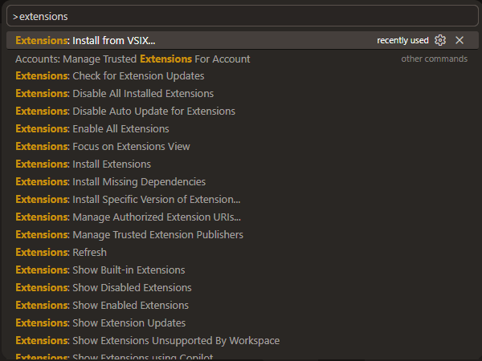

# Stardew-Cursor
Complete Stardew theme for vscode and Cursor.  

# Use this guide for installing this theme pack

* Git clone this repo and `cd` into it.
* Open your cursor or vscode
* `CTRL + SHIFT + 'P'` to open the command pallet
* Type: `>Extension: Install from VSIX`
[]
* Load all the files and change your `theme` `icon` and rest should automatically get installed.
